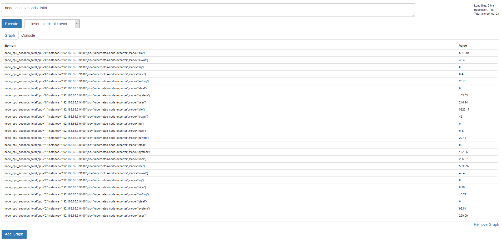
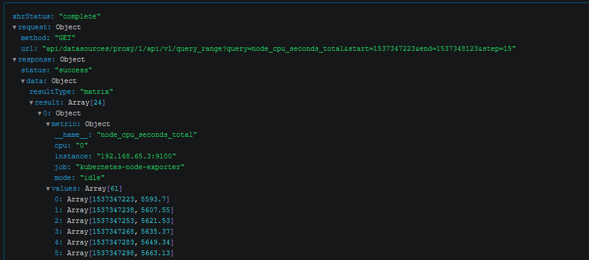
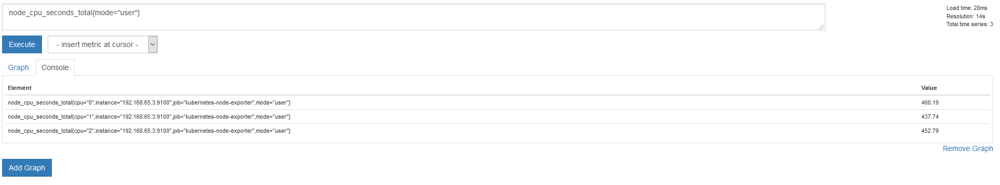
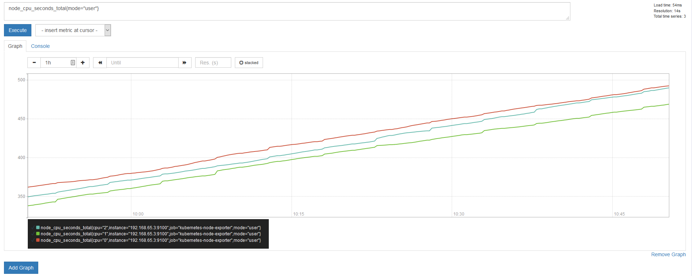
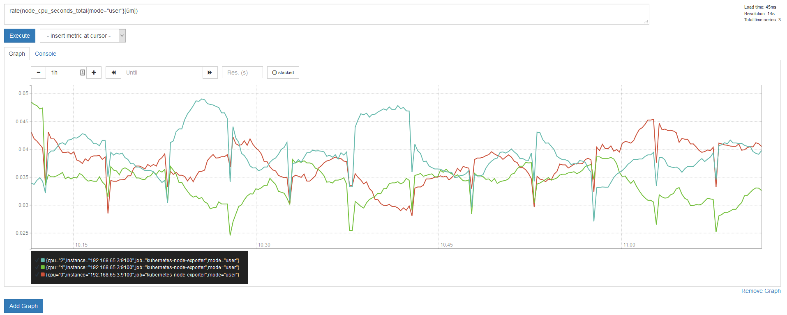
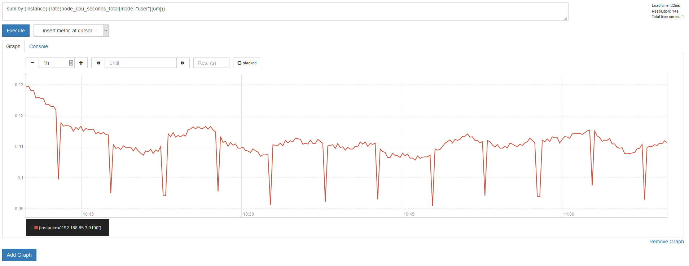
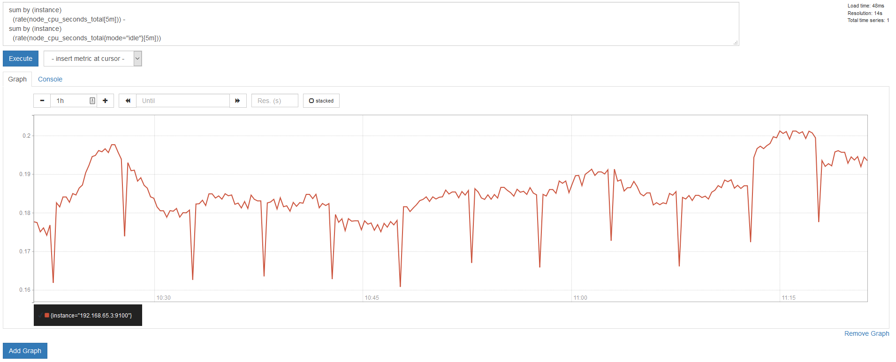

# Prometheus

- [Prometheus](#prometheus)
  - [Overview](#overview)
    - [What?](#what)
    - [Why?](#why)
    - [How?](#how)
      - [Data model](#data-model)
      - [Architecture](#architecture)
  - [Configuration](#configuration)
  - [Getting Metrics](#getting-metrics)
    - [Example](#example)
  - [Alerting](#alerting)
  - [Pushgateway](#pushgateway)
  - [Storage](#storage)
  - [Federation](#federation)

## Overview
### What?
Prometheus is an open-source [white-box systems monitoring](https://insights.sei.cmu.edu/devops/2016/08/whitebox-monitoring-with-prometheus.html) and alerting tool, built by SoundClod in 2012, now an official [CNCF](https://www.cncf.io/) project.  It pulls metrics from specified or discovered targets (servers, applications, network devices, etc.) and stores them in a  local time series database, offering query and alerting functionalities on top of that.

### Why?
Prometheus has established itself as something of an [industry standard](https://ordina-jworks.github.io/monitoring/2016/09/23/Monitoring-with-Prometheus.html#rise-of-prometheus) for monitoring both on-premise and cloud-based applications. [Many applications](https://prometheus.io/docs/instrumenting/exporters/#software-exposing-prometheus-metrics) export metrics natively and there a many of [third-party exporters](https://prometheus.io/docs/instrumenting/exporters/#third-party-exporters) available for existing applications. For new applications, [client libraries](https://prometheus.io/docs/instrumenting/clientlibs/) can be used to export metrics natively.

For example, all of Kubernetes's internal systems export Prometheus-style metrics natively and service discovery can be used to dynamically find new pods in the cluster.

Additionally, Prometheus has various components to enable graphing, alerting or pushing metrics.

### How?
#### Data model
A multi-dimensional [data model](https://prometheus.io/docs/concepts/data_model/) enables unique identification of metrics by name and a set of key-value pairs. This in turn allows for easy filtering, grouping and matching them by Prometheus's [query language](https://prometheus.io/docs/prometheus/latest/querying/basics/).
> Labels enable Prometheus's dimensional data model: any given combination of labels for the same metric name identifies a particular dimensional instantiation of that metric (for example: all HTTP requests that used the method POST to the /api/tracks handler).

A time series consists of multiple **samples**. A sample is a pair of a float64 **numerical value** and a milisecond-precision **time stamp**. Notation: `<metric name>{<label name>=<label value>, ...}`

For example:
- `node_cpu_seconds_total` identifies **all** time series with that metric name.
- `node_cpu_seconds_total{cpu="2",instance="192.168.65.3:9100",job="kubernetes-node-exporter",mode="user"}` identifies a **single** time series with a possible value of **513.21**. The timestamp is often omitted.

#### Architecture


Prometheus pulls metrics from targets specified via static configuration or service discovery. Alternatively, metrics can be pushed (from short-lived jobs for example) to the Pushgateway, whose endpoint Prometheus then scrapes like every other target. 

Samples are saved in a local time series database on disk, but can also be read from (and written to) remote storage. An HTTP server handles external requests to the internal TSDB.

Time series can be visualized via the Prometheus's web UI, its REST API or external dashboard tools like Grafana.

Alerts are defined via rules and are pushed to [Alertmanager](https://prometheus.io/docs/alerting/alertmanager/) for grouping and notifications.

## [Configuration](https://prometheus.io/docs/prometheus/latest/configuration/configuration/)
Prometheus is configured via command-line arguments and a configuration file, normally located under `/etc/prometheus/prometheus.yml`

Static targets can be defined via the `static_configs` directive. In the following example, we're scraping the metrics Prometheus exposes about itself:

```yaml
# prometheus.yml

global:
  scrape_interval: 15s

scrape_configs:
  - job_name: 'prometheus'
    static_configs:
      - targets: ['localhost:9090']
```

Prometheus can also dynamically populate target URLs via service discovery (Kubenertes, DNS, AWS, Azure, etc.):

```yaml
# prometheus.yml

scrape_configs:
  # Gather metrics from Google cAdvisor
  - job_name: 'kubernetes-cadvisor'
    
    # Instead of querying the kubelet directly, we're gathering metrics from the API server
    scheme: https
    tls_config:
      ca_file: /var/run/secrets/kubernetes.io/serviceaccount/ca.crt
    bearer_token_file: /var/run/secrets/kubernetes.io/serviceaccount/token
    
    # Discover Kubernetes Nodes
    kubernetes_sd_configs:
    - role: node
    
    relabel_configs:
    # Use all targets that have this Kubernetes label set
    - action: labelmap
      regex: __meta_kubernetes_node_label_(.+)

    # Replace the default source address of each time series with kubernetes.defaul.svc:443
    - target_label: __address__
      replacement: kubernetes.default.svc:443
    
    # Set the metrics path to the Kubernetes API proxy endpoint
    # __address__ = http://192.168.90.10:9090  =>
    # __address__ = https://kubernetes.default.svc:443//api/v1/nodes/docker-for-desktop/proxy/metrics/cadvisor
    - source_labels: [__meta_kubernetes_node_name]
      regex: (.+)
      target_label: __metrics_path__
      replacement: /api/v1/nodes/${1}/proxy/metrics/cadvisor
```

We can use Kubenertes annotations to define targets to be scraped:

```yaml
# redis-deploy.yml

apiVersion: apps/v1
kind: Deployment
metadata:
  name: redis-master
  labels:
    app: redis
spec:
  selector:
    matchLabels:
      app: redis
  replicas: 1
  template:
    metadata:
      labels:
        app: redis
      annotations:
        prometheus.io/scrape: "true"
        prometheus.io/port: "9121"
# ...
```

```yaml
#  prometheus.yml

scrape_configs:
  - job_name: 'kubernetes-pods'

    kubernetes_sd_configs:
      - role: pod

    relabel_configs:
      # Use all targets that have the annotation prometheus.io/scrape: "true"
      - source_labels: [__meta_kubernetes_pod_annotation_prometheus_io_scrape]
        action: keep
        regex: true

      # Replace the default scrape port with the one set in the annotation
      - source_labels: [__address__, __meta_kubernetes_pod_annotation_prometheus_io_port]
        action: replace
        regex: ([^:]+)(?::\d+)?;(\d+)
        replacement: $1:$2
```

## Getting Metrics
Metrics can be gathered via Prometheus's web ui (e.g. [http://localhost:9090/](http://localhost:9090/)) or Grafana. Time series of metrics are retrieved via [PromQL](https://prometheus.io/docs/prometheus/latest/querying/basics/).

### Example
Let's say we want to know how much CPU is being used on a specific node. This is our **metric**, identified by the **metric name** (which is exported by [node exporter](https://github.com/prometheus/node_exporter)):

```
node_cpu_seconds_total
``` 

We can run this as a query (which we can enter in Prometheus' web UI), which will give us **all timeseries** associated with this metric name:



The first row shows one **sample**:

```
node_cpu_seconds_total{cpu="0",instance="192.168.65.3:9100",job="kubernetes-node-exporter",mode="idle"} = 5816.04
```

which is identified by the metric name and contains a **float 64 value** and a **millisecond-precision timestamp**, which has been omitted by the Prometheus UI. We can check it using the Query explorer that comes with [Grafana](https://grafana.com/):



We can now use labels to reduce the number of time series being returned. Let's display all time series related to CPU usage by processes from the [user space](https://en.wikipedia.org/wiki/User_space):

```
node_cpu_seconds_total{mode="user"}
```



Now we have three series left, telling us the usage over all three available cores. However, this value is a **counter**, which means it can only increase in value (more information about the different metric types can be found [here](https://prometheus.io/docs/concepts/metric_types/)):



What's more interesting is how the consumption has changed over a given period of time, let's say five minutes. We can use the [rate()](https://prometheus.io/docs/prometheus/latest/querying/functions/#rate) function to display the per-second averages of increases in our time series:

```
rate(node_cpu_seconds_total{mode="user"}[5m])
```



Also we don't necessarily care about each individual core, but would rather like to see the consumption over all cores. We can use the [sum()]() function with the `by (<label_name>)` directive to group our results accordingly:

```
sum by (instance) (rate(node_cpu_seconds_total{mode="user"}[5m]))
```



While this displays the CPU usage by user processes, it doesn't tell us about the total CPU usage. For this we substract the time a CPU spends in idle from the the total usage time:

```
sum by (instance) 
  (rate(node_cpu_seconds_total[5m])) - 
sum by (instance) 
  (rate(node_cpu_seconds_total{mode="idle"}[5m]))
```



## [Alerting](https://prometheus.io/docs/prometheus/latest/configuration/alerting_rules/)
Alert rules are written in PromQL and defined as YAML files that are imported via Prometheus's `prometheus.yml`. Rule files use go-templates to populate the notification text. Alerts should be labeled for further processing.

The following example will fire an alert if total CPU usage on a node has been above 75% for over 2 minutes:

```yaml
# simple-alerts.yml

groups:
- name: NodeCPU
  rules:
  - alert: HighNodeCPUUsageTotal
    expr: avg( ( ( sum by (instance) ( rate(node_cpu_seconds_total[1m]) ) - sum by (instance) ( rate(node_cpu_seconds_total{mode="idle"}[1m]) ) ) * 100 ) / scalar( count( sum by (instance, cpu) (node_cpu_seconds_total) ) ) ) > 75
    for: 2m
    labels:
      severity: high
      resource: cpu
    annotations:
      summary: "High CPU Load on {{ $labels.instance }}"
      description: "Total CPU usage of instance {{ $labels.instance }} has been >75% for over 2m."
```

[Alertmanager](https://prometheus.io/docs/alerting/alertmanager/) is used to pick up alerts, group them and send out specific notifications. Alertmanager needs to be deployed and configured seperately. There are several notification backends available such as E-Mail, Slack, PagerDuty or webhooks.

```yaml
# prometheus.yml

rule_files:
  - "simple-alerts.yml"

alerting:
  alertmanagers:
    # Setting the alertmanager address via static_config (service discovery is possible too)
    - static_configs:
      - targets: ["prometheus-alertmanager.monitoring.svc.cluster.local:9093"]

# ...
```

In the following example, Alertmanager will pick up alerts matching the `resource: cpu` label and forwards them to the `test-emails` receiver. Additionally, there is a sub-route that groups previously-matching alerts that also match the `severity: high` label and forwards them to the `crit-emails` recevier.

```yaml
# alertmanager.yml

global:
  smtp_smarthost: 'mailhog.monitoring.svc.cluster.local:1025'
  smtp_from: 'alertmanager@example.com'
  smtp_require_tls: false
  smtp_hello: 'k8s-alertmanager'

# Default route
route:
  group_by: [alertname, resource, severity]

  # Default receiver
  receiver: test-emails

  # Child routes
  routes:
    
  # Creating a rule for CPU related alerts
  - match_re:
      resource: ^cpu$
    receiver: cpu-mails

    # Sub route for critical CPU alerts
    routes:
    - match:
        severity: critical
      receiver: crit-mails

# Setting different receivers
receivers:
- name: 'test-emails'
  email_configs:
  - to: 'test-emails@example.com'
- name: 'crit-emails'
  email_configs:
  - to: 'crit-emails@example.com'

```
An example of a simple Alertmanage configuration file can be found [here](https://github.com/prometheus/alertmanager/blob/master/doc/examples/simple.yml).


## [Pushgateway](https://prometheus.io/docs/practices/pushing/)
In some cases, pushing metrics can be beneficial, like for short-lived jobs. For that, the [Pushgateway](https://github.com/prometheus/pushgateway) is used as an intermediary service to cache metrics.

## [Storage](https://prometheus.io/docs/prometheus/latest/storage/)
Prometheus stores time series locally on disk (default: `/prometheus`), with a default retention time of 15 days. One sample uses about 1-2 bytes and capacity can be calculated with:
```
needed_disk_space = retention_time_seconds * ingested_samples_per_second * bytes_per_sample
```

The total number of time series scraped can be retrieved via the query `count(name{=~".+"})`. 

Assuming we are scraping 3300 time series with a retention period of 15 days, a scrape interval of 15 seconds and a size of 1-2 byte per sample, we would need about 285MB - 570MB of storage:

```
1 296 000 * (3300 / 15) * 2 = 570 MB
```

[Remote storage](https://prometheus.io/docs/operating/integrations/#remote-endpoints-and-storage) read/write integrations are available for services such as Elasticsearch, Graphite, InfluxDB or PostgreSQL.

## [Federation](https://prometheus.io/docs/prometheus/latest/federation/)
> A single Prometheus server can easily handle millions of time series. That's enough for a thousand servers with a thousand time series each scraped every 10 seconds. As your systems scale beyond that, Prometheus can scale too. [[Link]](https://www.robustperception.io/scaling-and-federating-prometheus)

There are two ways to scale/federate Prometheus: hierarchical and cross-service. Hierarchical means constructing a tree-like topology where higher level Prometheus servers collect time series from subordinated servers. Cross-service means that there individual Prometheus servers for speific services: one for all Cassandra services, one for all loadbalancers, etc. Those individual servers can then be aggregated and federated into a single Prometheus instance.

Federation can be set up through a specific configuration directive. More information can be found [here](https://prometheus.io/docs/prometheus/latest/federation/#configuring-federation).
